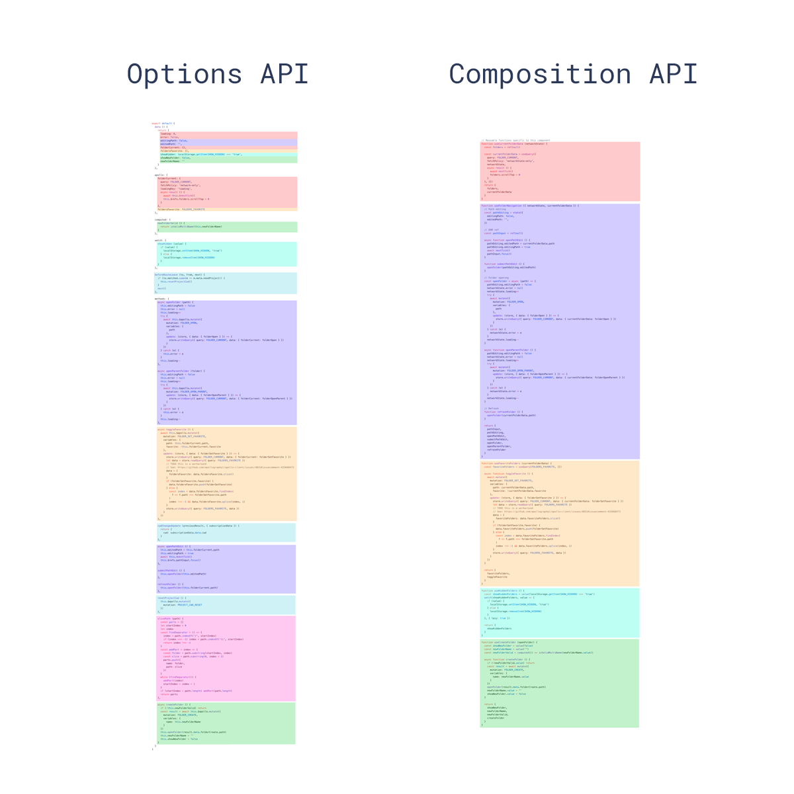

## 1. “组合”的由来

### 1.1 组合式函数

在 Vue 应用的概念中，“组合式函数”(Composables) 是一个利用Vue的组合式API来封装和复用**有状态逻辑**的函数。

#### 1.1.1 示例：鼠标跟踪器

##### 一般写法

```js
<script setup>
import { ref, onMounted, onUnmounted } from 'vue'

const x = ref(0)
const y = ref(0)

function update(event) {
  x.value = event.pageX
  y.value = event.pageY
}

onMounted(() => window.addEventListener('mousemove', update))
onUnmounted(() => window.removeEventListener('mousemove', update))
</script>

<template>Mouse position is at: {{ x }}, {{ y }}</template>
```

##### 组合式函数写法

```js
// mouse.js
import { ref, onMounted, onUnmounted } from 'vue'

// 按照惯例，组合式函数名以“use”开头
export function useMouse() {
  // 被组合式函数封装和管理的状态
  const x = ref(0)
  const y = ref(0)

  // 组合式函数可以随时更改其状态。
  function update(event) {
    x.value = event.pageX
    y.value = event.pageY
  }

  // 一个组合式函数也可以挂靠在所属组件的生命周期上
  // 来启动和卸载副作用
  onMounted(() => window.addEventListener('mousemove', update))
  onUnmounted(() => window.removeEventListener('mousemove', update))

  // 通过返回值暴露所管理的状态
  return { x, y }
}
```

```js
// 使用上面的组合式函数
<script setup>
import { useMouse } from './mouse.js'

const { x, y } = useMouse()
</script>

<template>Mouse position is at: {{ x }}, {{ y }}</template>
```

##### 写法对比

两种写法的核心逻辑完全一致，组合式函数只是把核心逻辑挪到了一个函数里，并返回了需要暴露的状态。除此之外，一个组合式函数内还可以嵌套多个组合式函数。

#### 1.1.2 组合式函数写法约定

##### 命名

约定使用驼峰命名法，并以“use”作为开头；

##### 输入参数

即便不依赖于 ref 或 getter 的响应性，组合式函数也可以接收它们作为参数。如果你正在编写一个可能被其他开发者使用的组合式函数，最好处理一下输入参数是 ref 或 getter 而非原始值的情况，可以使用`toValue()`：

```js 异步状态示例
// fetch.js
import { ref, watchEffect, toValue } from 'vue'

export function useFetch(url) {
  const data = ref(null)
  const error = ref(null)

  const fetchData = () => {
    // reset state before fetching..
    data.value = null
    error.value = null

    fetch(toValue(url))
      .then((res) => res.json())
      .then((json) => (data.value = json))
      .catch((err) => (error.value = err))
  }

  watchEffect(() => {
    fetchData()
  })

  return { data, error }
}
```

##### 返回值

为了确保返回值被解构之后仍然保持响应式，所以推荐在组合式函数中使用`ref()`，**而不是**`reactive()`。

```js
// 使用时直接解构：
const { x, y } = useMouse()

// 假如想用obj.x的方式使用，需要使用reactive()包裹一次：
const mouse = reactive(useMouse())
// mouse.x 链接到了原来的 x ref
console.log(mouse.x)
```

##### 副作用

在组合式函数中的确可以执行副作用 (例如：添加`DOM`事件监听器或者请求数据)，但请注意以下规则：

- 如果你的应用用到了服务端渲染 (SSR)，请确保在组件挂载后才调用的生命周期钩子中执行`DOM`相关的副作用，例如：`onMounted()`。这些钩子仅会在浏览器中被调用，因此可以确保能访问到`DOM`。

- 确保在`onUnmounted()`时清理副作用。举例来说，如果一个组合式函数设置了一个事件监听器，它就应该在`onUnmounted()`中被移除 (就像我们在`useMouse()`示例中看到的一样)。

##### 使用限制

组合式函数只能在`<script setup>`或`setup()`钩子中被调用。在这些上下文中，它们也只能被**同步**调用。在某些情况下，你也可以在像`onMounted()`这样的生命周期钩子中调用它们。

### 1.2 “组合”的由来

一个组合式函数内可以嵌套多个组合式函数，这使得我们可以像使用多个组件组合成整个应用一样，用多个较小且逻辑独立的单元来组合形成复杂的逻辑。实际上，这正是为什么我们决定将实现了这一设计模式的 API 集合命名为组合式 API。

## 2. 什么是组合式API

组合式API(Composition API)是一系列API的集合，使得我们可以使用函数而不是生命选项的方式书写vue组件。
涵盖以下几个方面的API：

- 响应式API：如`ref()`和`reactive()`，可以直接创建响应式状态。计算属性和侦听器；
- 生命周期钩子：如`onMounted()`和`onUnMounted()`，用以在组件各个生命周期阶段添加逻辑；
- 依赖注入：如`provide()`和`inject()`，使我们可以在使用响应式API时，里用vue的依赖注入系统。

> Tip: 组合式 API 是 Vue 3 及 Vue 2.7 的内置功能。对于更老的 Vue 2 版本，可以使用官方维护的插件 [@vue/composition-api](https://github.com/vuejs/composition-api)。在 Vue 3 中，组合式 API 基本上都会配合`<script setup>`语法在单文件组件中使用。
>
> 注意：虽然这套 API 的风格是基于函数的组合，但组合式API并**不是函数式编程**。组合式API是以Vue中数据可变的、细粒度的响应性系统为基础的，而函数式编程通常强调数据不可变。

## 3. 组合式API的优点

- 更好的逻辑复用：
组合式API使我们能够通过组合函数来实现更加简洁高效的逻辑复用。
在选项式API中我们主要的逻辑复用机制是mixins，而组合式API解决了mixins的所有缺陷。
  - [mixins的缺陷](https://cn.vuejs.org/guide/reusability/composables.html#vs-mixins)：
    - 数据来源不清晰；
    - 命名空间易冲突；
    - 隐式的跨mixin交流：多个 mixin 需要依赖共享的属性名来进行相互作用，这使得它们隐性地耦合在一起。

- 更灵活的代码组织:

- 更好的类型推导
- 更小的生产包体积：
搭配`<script setup>`使用组合式API比等价情况下的选项式API更高效，对代码压缩也更友好。这是由于`<script setup>`形式书写的组件模板被编译为了一个内联函数，和`<script setup>`中的代码位于同一作用域。不像选项式API需要依赖this上下文对象访问属性，被编译的模板可以直接访问`<script setup>`中定义的变量，无需从实例中代理。这对代码压缩更友好，因为本地变量的名字可以被压缩，但对象的属性名则不能。

## 与选项式API的关系

参考<https://cn.vuejs.org/guide/extras/composition-api-faq.html#relationship-with-options-api>
