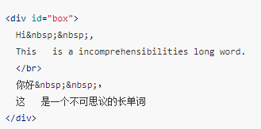
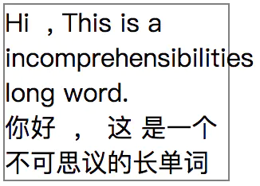
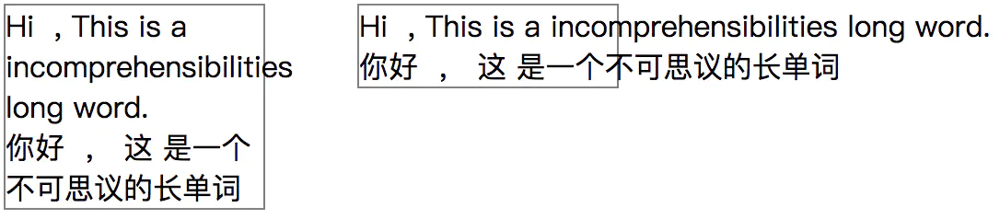
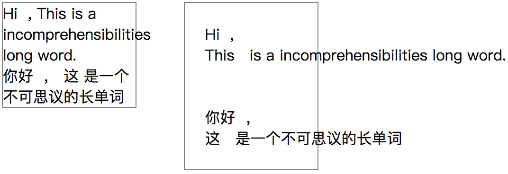
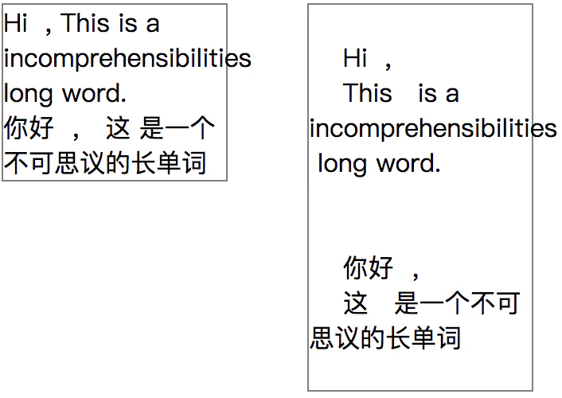
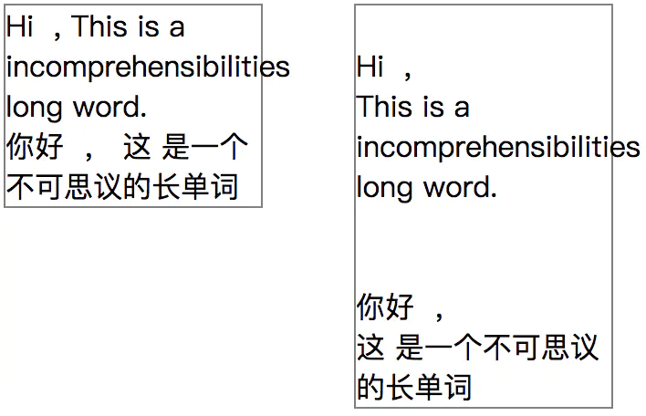
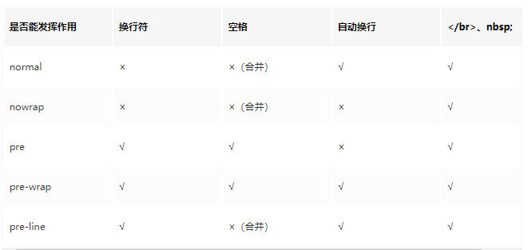
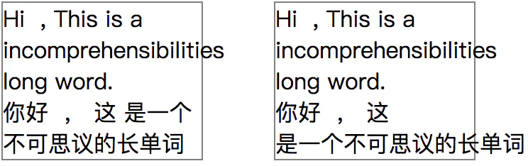
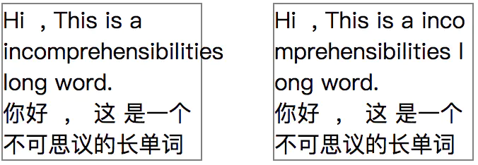
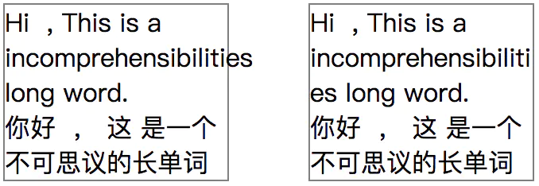

# 彻底搞懂word-break、word-wrap和white-space
- white-space：控制空白字符的显示，同时还可以控制是否自动换行。有五个值：normal | nowrap | pre | pre-wrap | pre-line；
- word-break：控制单词如何被拆分换行。有四个值：normal | break-all | keep-all | bread-word(废弃)
- word-wrap: 又叫overflow-wrap，是word-break的补充。控制长度超过一行的单词是否被拆分换行。有两个值：normal | break-word

### 1.1 测试代码和默认效果：

只加了一个宽度和边框，没有任何其它样式：

__默认效果__：
1) \&nbsp;和\ 可以正常发挥作用; 
2) 连续的空格会缩减成一个; 
3) 换行符也无效; 
4) 句子超过一行后自动换行; 5)长度超过一行的单词会超出边界

### 1.2 white-space：normal | nowrap | pre | pre-wrap | pre-line
#### 1.2.1 white-space作用：
用来控制空白字符的显示，同时还能控制是否自动换行
#### 1.2.2 white-space: nowrap (左图为最初的效果，右图加了white-space:nowrap)

__结论：__ 使文本不能自动换行，\ 还是可以换行。可以将其理解为“永不换行”
#### 1.2.3 white-space: pre

__结论：__ pre是preserve(保留)的缩写。保留原有的所有空格和换行符，自动换行失效。
#### 1.2.4 white-space:pre-wrap

__结论：__ pre-wrap == pre + wrap；保留原有的所有空格和换行符，且可以自动换行
#### 1.2.5 white-space:pre-line

__结论：__ line == new line， pre-line == preserve newline + wrap。空格被合并，换行符依然起作用，自动换行还在
#### 1.2.6 总结：

### 1.3 word-break: normal | break-all | keep-all | break-word
用于控制单词如何被拆分换行
#### 1.3.1 word-break: keep-all

__结论：__ CJK(指中文、日文、韩文)文本不断行。 Non-CJK 文本表现同 normal。可以理解为“只有空格可以触发自动换行”。
#### 1.3.2 word-bread: break-all

__结论：__ 所有单词碰到边界一律拆分换行
#### 1.3.3 word-break: break-word（这个api在mdn里已废弃，只有chrome、safari等部分浏览器支持）
__结论：__ 它的效果是word-bread: normal + overflow-wrap:anywhere，不论overflow-wrap的值是多少

### 1.4 word-wrap(又叫overflow-wrap): normal | break-word
- word-wrap 属性原本属于微软的一个私有属性，在 CSS3 现在的文本规范草案中已经被重名为 overflow-wrap 。 word-wrap 现在被当作 overflow-wrap 的 “别名”。 稳定的谷歌 Chrome 和 Opera 浏览器版本支持这种新语法。
- 作用：也是控制单词如何被拆分换行的，实际上是作为word-break的互补
#### 1.4.1 word-wrap: break-word

结论：只有当一个单词一整行都显示不下时，才会拆分换行该单词