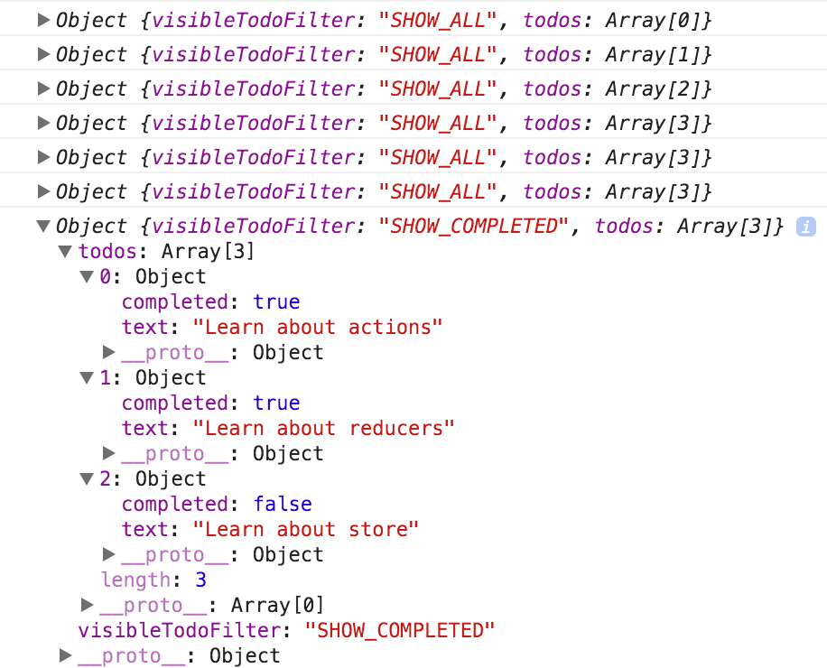

### 1. store是什么

action描述“发生了什么”，使用reducers来根据action更新state，而Store就是把它们联系到一起的对象。

Store有以下职责：

- 维持应用的state;
- 提供 [`getState()`](https://www.redux.org.cn/docs/api/Store.html#getState) 方法获取 state；
- 提供 [`dispatch(action)`](https://www.redux.org.cn/docs/api/Store.html#dispatch) 方法更新 state；
- 通过 [`subscribe(listener)`](https://www.redux.org.cn/docs/api/Store.html#subscribe) 注册监听器: 一旦 State 发生变化，就自动执行这个函数
- 通过 [`subscribe(listener)`](https://www.redux.org.cn/docs/api/Store.html#subscribe) 返回的函数注销监听器。

### 2. 创建store

createStore(reducers, initState)： 第二个参数是可选的, 用于设置 state 初始状态

```
import { createStore } from 'redux'
import todoApp from './reducers'
let store = createStore(todoApp, window.STATE_FROM_SERVER)
```

### 3. 发起Actions

- 注册监听器
- 发起action
- 注销监听器

```
import {
  addTodo,
  toggleTodo,
  setVisibilityFilter,
  VisibilityFilters
} from './actions'

// 打印初始状态
console.log(store.getState())

// 每次 state 更新时，打印日志
// 注意 subscribe() 返回一个函数用来注销监听器
const unsubscribe = store.subscribe(() =>
  console.log(store.getState())
)

// 发起一系列 action
store.dispatch(addTodo('Learn about actions'))
store.dispatch(addTodo('Learn about reducers'))
store.dispatch(addTodo('Learn about store'))
store.dispatch(toggleTodo(0))
store.dispatch(toggleTodo(1))
store.dispatch(setVisibilityFilter(VisibilityFilters.SHOW_COMPLETED))

// 停止监听 state 更新
unsubscribe();
```

