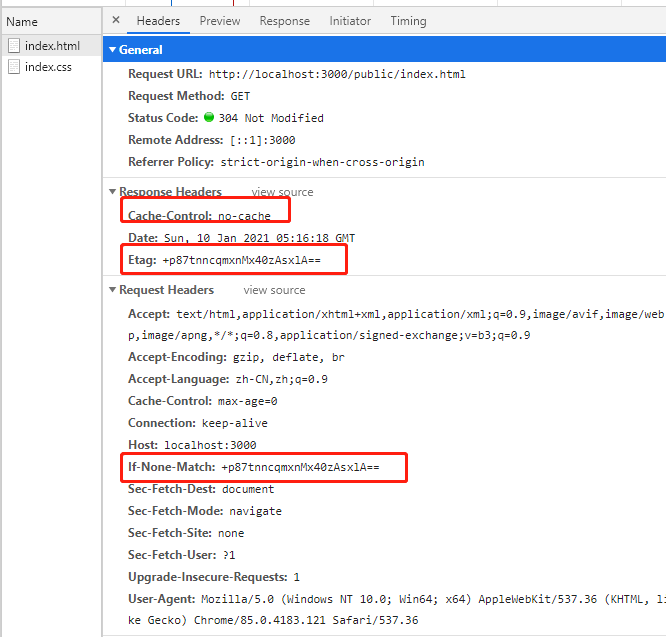

# 1. 前言
前端缓存与浏览器存储不一样。   
缓存: cache   
浏览器存储：sessionStorage, localStorage, cookie, indexedDB...

我们所谓的做缓存，其实并不是说在服务端自己去“做缓存”，而是通过服务端告诉浏览器是否要是用缓存，和怎么去使用缓存的一些规则而已

## 1.1 什么时候会缓存
针对某一个资源，比如index.html。如果设置了缓存策略，第一次请求该资源后，浏览器会将其缓存。在后续的请求时，如果缓存未过时，则拿缓存里的资源且状态码为200。具体如何判断缓存是否过时，就要看使用的缓存类型了。


## 1.2 缓存位置：缓存区
浏览器有缓存区。优先存储在memory cache，其次是disk cache。

## 1.3 准备工作
这里我们使用node来写一个静态文件服务器，方便看缓存效果。目录结构如下：

```js
const fs = require('fs');
const http = require('http');
const url = require('url');
const path = require('path');

// 手写一个简单的静态服务器
const server = http.createServer((req, res) => {
    const { pathname } = url.parse(req.url);
    const filePath = path.join(__dirname, pathname);

    fs.stat(filePath, (err, stats) => {
        if(err) {
            res.statusCode = 404;
            res.end('Not found!');
        }
        if(stats?.isFile()) {
            /* Start: 设置缓存策略 */
            // 缓存策略
            /* End: 设置缓存策略 */
        } else {
            res.statusCode = 404;
            res.end('Not found!')
        }
    })
});

server.listen(3000, console.log('server listening on 3000'));

```

# 2. 缓存的种类
## 2.1 强制缓存
- 第一次访问服务器取到数据之后，在过期时间之内不会再去重复请求，而是直接拿到浏览器缓存的资源。
- 注意：直接访问的资源不会走缓存，只有引用的资源走缓存。

#### 设置头：
```js
// 设置后：第一次请求后30秒内再发请求都走浏览器缓存
res.setHeader('Cache-Control', 'max-age=30'); // max-age单位为秒，相对时间
res.setHeader('Expires', new Date(Date.now() + 1000 * 30).toUTCString()); // expires针对低版本浏览器，且设置的
```

#### 例子：
```js
// 完整代码见：同级目录example/qiangzhi_cache.js
/* Start: 设置缓存策略 */
    console.log(filePath)
    // 设置后：第一次请求后30秒内再发请求都走浏览器缓存
    res.setHeader('Cache-Control', 'max-age=30'); // max-age单位为秒，相对时间
    res.setHeader('Expires', new Date(Date.now() + 1000 * 30).toUTCString()); // expires针对低版本浏览器，且设置的时绝对时间
    fs.createReadStream(filePath).pipe(res);
/* End: 设置缓存策略 */
```

#### 运行结果：30s内发送第二次请求
1）node端：
直接访问的资源不会走缓存，所以还是由node服务器返回。


2）浏览器：   


#### 缺陷：
- 超出设置的时间后，请求必然走服务器。若此时文件依然未修改，就会造成浪费。
- 没超出设置时间时，文件修改了，但依然走缓存，与实际不符。

#### 使用场景：
需要长时间缓存的东西，比如百度的logo

## 2.2 协商缓存
### 2.2.1 什么是协商缓存
浏览器缓存了文件，但是具体用不用这个缓存，需要每次询问服务器，服务器再告诉你该不该使用缓存，这就是协商缓存。

向服务器发送请求，服务器会根据这个请求的request header的一些参数来判断是否命中协商缓存，如果命中，则返回304状态码并带上新的response header通知浏览器从缓存中读取资源；

做协商缓存之前，我们先把强缓存关掉：
```
res.setHeader('Cache-Control', 'no-cache')
```
- no-cache: 表示浏览器依然会缓存文件，但是每次还是要去访问服务器
- no-store：表示直接告诉浏览器，不要缓存文件，每次都请求服务器

### 2.2.2 协商缓存 - Last-Modified
根据资源的修改时间进行比较。
#### 设置头：
```js
res.setHeader('Last-Modified', mtime)
req.headers['if-modified-since']
```

#### 例子：
```js
// 完整代码见：同级目录example/xieshang_lastmodified_cache.js
/* Start: 设置缓存策略 */
    console.log(filePath)
    res.setHeader('Cache-Control', 'no-cache');
    const mtime = stats.ctime.toUTCString();
    if(req.headers['if-modified-since'] == mtime) {
        res.statusCode = 304;
        res.end();
    } else {
        res.setHeader('Last-Modified', mtime)
        fs.createReadStream(filePath).pipe(res);
    }
/* End: 设置缓存策略 */
```
#### 运行过程：
- 浏览器第一次请求`index.html`文件；
- 服务器将`index.html + 时间标识`返回。时间标识告诉浏览器这个文件最近的`修改时间`；
- 浏览器收到服务器返回的`index.html + 时间标识`，并将`index.html`存储在缓存区中；
- 浏览器第二次请求时，会把时间标识也带上；
- 服务器拿到请求，对比`时间标识`和`index.html`最近的修改时间。如果相等，告诉浏览器文件未修改，走浏览器缓存，状态码置为`304`。

1）node端：


2）浏览器：第二次请求


#### 缺陷：
- 修改时间是秒级的，如果1s内做了修改，从时间上是认为没有修改的;
- 先修改一次，然后撤销修改，时间变化了，但文件其实没变，浏览器会认为文件修改了;
- CND分发，放到别的服务器上的时间，文件时间可能不一样。

### 2.2.3 协商缓存 - Etag
为了弥补`Last-Modified`方式的缺陷，我们的解决方案是根据文件内容生成一个MD5戳，那么这个MD5戳如何去生成？我们需要用到一个node的核心模块，crypto，专用于处理加密的包。具体的介放到了后面。

摘要出来的MD5戳，我们会用一个`header`头叫`Etag`来告诉浏览器，Etag生成的策略每个厂都不一样，总之是根据文件内容，摘要生成一个md5值。

#### 设置头：
```js
res.setHeader('Etag', etag)
req.headers['if-none-match']
```
#### 例子：
```js
// 完整代码见：同级目录example/xieshang_etag_cache.js
/* Start: 设置缓存策略 */
    console.log(filePath)
    res.setHeader('Cache-Control', 'no-cache');
    const etag = crypto.createHash('md5').update(fs.readFileSync(filePath)).digest('base64');
    if(req.headers['if-none-match'] == etag) {
        res.statusCode = 304;
        res.end();
    } else {
        res.setHeader('Etag', etag)
        fs.createReadStream(filePath).pipe(res);
    }
/* End: 设置缓存策略 */
```
#### 运行过程：
只是将`Last-Modified`方式的`时间戳`换成了一个`MD5戳`，其余一致。

1）node端：


2）浏览器：第二次请求




# 3. 最佳做法：强制与协商并存


# 4. 补充：加密算法
具体讲之前，先给大家讲讲什么是加密算法。我们平时老是说`md5加密`，`sha1/sha256加密`，其实都是不太准确的，准确来说，`md5`是`摘要算法`，`sha1/sha256`是`加盐算法`。

加密算法是指，加密后可解密的算法，例如我们熟知的对称加密算法（公私钥）。
## 4.1 MD5摘要算法
- 不能解密，加密不可逆，因此不算加密算法。（网上很多都说md5加密算法，这种说法不对。网上说的解密其实是暴力碰撞，专业点叫撞库）；
- 具有雪崩效应，意思是如果内容有一点改变，MD5摘要值将完全不同；
- 不安全，容易被反解。 解决方案就是下面的加盐算法或者说多轮次MD5摘要。
```js
crypto.createHash('md5').update('123').digest('base64')
```
## 4.2 加盐算法（如SHA1、SHA256）
- 其实也是一种摘要算法；比一般的摘要算法多了盐值。在加密过程中，是根据`摘要 + 盐值`来加密的；
- 盐值一般存储在服务器，别人拿不到；
- 如：'123' + '盐值' ==> 摘要的结果。

# 5. 纯前端如何应对缓存（webpack）
在更新版本之后，如何让用户第一时间使用最新的资源文件呢？机智的前端们想出了一个方法，在更新版本的时候，顺便把静态资源的路径改了，这样，就相当于第一次访问这些资源，就不会存在缓存的问题了。

```js
// 伟大的webpack可以让我们在打包的时候，在文件的命名上带上hash值。
entry:{
    main: path.join(__dirname,'./main.js'),
    vendor: ['react', 'antd']
},
output:{
    path:path.join(__dirname,'./dist'),
    publicPath: '/dist/',
    filname: 'bundle.[chunkhash].js'
}
```